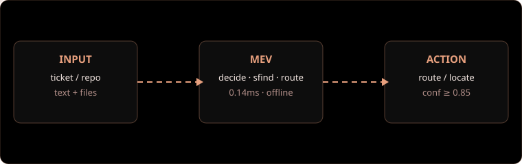

# MEV


[](LICENSE)
[](https://www.python.org/downloads/)
[](#dosyalar)
[](test_all.py)

İnternetsiz çalışan küçük bir karar motoru ve dosya bulucu. Metin üretmez,
tahmin yürütmez; hazır seçeneklerden birini ve ne kadar emin olduğunu söyler.


## İçindekiler

- [Genel Bakış](#genel-bakış)
- [Mimari](#mimari)
- [Hızlı Başlangıç](#hızlı-başlangıç)
- [Kurulum](#kurulum)
- [Kullanım](#kullanım)
- [Araç Referansı](#araç-referansı)
- [Yapılandırma](#yapılandırma)
- [Ölçümler](#ölçümler)
- [Rakiplerden Farkı](#rakiplerden-farkı)
- [Proje Yapısı](#proje-yapısı)
- [Sınırlar](#sınırlar)
- [Lisans](#lisans)

## Genel Bakış

MEV iki iş yapar ve ikisini de bu makinede, dış servise gitmeden yapar:

1. **Karar verir** (`decide`). Gelen yazıyı okuyup hangi birime/etikete ait
   olduğunu olasılığıyla söyler. Örnek: "faturamda çift çekim var" → `billing`,
   güven 0.93.
2. **Dosya bulur** (`sfind`). Büyük repoda niyet cümlesiyle veya birebir
   metinle arama yapar. Örnek: "ödeme iade akışı nerede?" → ilgili dosyalar,
   olasılık sırasıyla.

Üçüncü bir yardımcı (`route`) metnin dilini milisaniyenin altında tespit eder.
Tamamı Python standart kütüphanesiyle yazılmıştır; kurulacak paket yoktur.

## Mimari



Akış tek yönlüdür: durum ve repo girer, tip'li karar çıkar, eşik aşılırsa kod
aksiyon alır. Model ağırlığı yoktur; `distilled_tasks.json` içindeki küçük
ağırlık tablosu (79KB) öğretmen bir modelden damıtılmıştır.

## Hızlı Başlangıç

```powershell
powershell -ExecutionPolicy Bypass -File kur.ps1
python dashboard.py
# http://127.0.0.1:47921
```

## Kurulum

`kur.ps1` (Windows) veya `install.sh` (macOS/Linux) üç iş yapar: testleri
çalıştırır, skill dosyasını ajanların gördüğü konumlara kopyalar
(`.config/opencode/skills`, `.claude/skills`, `.agents/skills`) ve MCP
kayıt bloğunu ekrana yazar.

**Zorunlu son adım:** IDE'yi kapatıp yeniden açın. MCP sunucuları ve
skill'ler açılışta yüklenir; yeniden başlatmadan görünmez. Bu durum Cursor,
Antigravity, Claude Code, terminal ve diğer tüm istemciler için geçerlidir.

Ajanınıza söylemeniz gereken tek cümle: **"mev kur"**.

### İstemci bazında bağlantı

opencode.json:

```json
{"mcp": {"mev": {"type": "local",
  "command": ["python", "C:/yol/Mev/mcp_server.py"], "enabled": true}}}
```

Claude Code (proje köküne `.mcp.json`):

```json
{"mcpServers": {"mev": {"command": "python",
  "args": ["C:/yol/Mev/mcp_server.py"]}}}
```

Cursor (`.cursor/mcp.json`) ve Antigravity (MCP ayar ekranına JSON olarak):

```json
{"mcpServers": {"mev": {"command": "python",
  "args": ["C:/yol/Mev/mcp_server.py"]}}}
```

Skill dosyası her ajanda aynıdır; konumu istemciye göre değişir
(`.opencode/skills/mev/`, `.claude/skills/mev/`, `.agents/skills/mev/`).
Kurulum betiği üçünü de yazar.

## Kullanım

**Kokpit.** `python dashboard.py` komutu dört bölmeli tarayıcı paneli açar:
karar, dosya bulma, dil tespiti ve agent bağlantı bilgileri. Port 47921
bilerek seçilmiştir; yaygın geliştirme portlarıyla çakışmaz.

**Komut satırı.**

```powershell
python mev.py demo        # çok dilli karar örneği
python mev.py bench       # hız ölçümü
python test_all.py        # 23 otomatik kontrol
python bench_repo.py --sizes 100 500 2000  # sentetik repo ölçümü
```

**HTTP.** `python mev.py serve --port 8013` sonrasında
`POST /api/alpha/decisions` ve `POST /v1/systemone` uçları karar döndürür.

## Araç Referansı

| Araç | Girdi | Çıktı |
|---|---|---|
| `decide` | `state`, `questions:{id:{type,instructions,criteria}}` | `choice`/`noul`/`score` + olasılık + güven |
| `sfind` | `query`, `root`, `top_k`, `mode`, `use_regex`, `case_sensitive`, `context`, `include`, `index` | sıralı dosya + snippet + güven + grep tahmini |
| `route` | `text` | dil/model + gerekçe + süre |

Uygulama kuralı: güven 0.85 ve üstünde otomatik devam edilir, 0.50 altında
insana sorulur. `sfind` önce niyetle (`semantic`) denenir; boş dönerse birebir
(`exact`) arama yapılır. `exact` hiçbir zaman `semantic`'in yerine geçmez.

## Yapılandırma

- `MAX_FILES=4000`, `BUDGET_MS=1500`: tarama üst sınırları; aşımda sonuç
  kesilir ve `timed_out:true` döner, program çökmez.
- `index:true`: `.mevidx` önbelleğini açar; tekrar aramalar hızlanır.
  Önbellek dosyası depoya işlenmez (`.gitignore` hazır gelir).
- Güven eşikleri istemci tarafındadır; motor ham olasılığı döndürür.

## Ölçümler

Kendi makinemizde ölçüldü; komutlarla tekrarlanabilir:

| Deney | Sonuç |
|---|---|
| Otomatik test | 23/23 geçti |
| 308 dosyalık repo, 5 soru | 5'te 5 ilk-sıra isabet |
| Tek karar süresi | ~0.14ms |
| 490 dosyalık gerçek proje, sıcak arama | 30-130ms |
| Türkçe niyet → İngilizce kod | grep 0 sonuç, MEV ilgili dosyayı buluyor |

## Rakiplerden Farkı

Sayılar kendi ölçümlerimiz ve yayınlanan belgelerdir.

| Boyut | MEV | Jev (TypeSafe, hosted API) | Laya (açık kaynak) | Graft | ripgrep |
|---|---|---|---|---|---|
| Ne yapar | tip'li karar + niyetle dosya bulma | tip'li karar API'si | tip'li karar modeli | repo anlam haritası | birebir string arama |
| Kurulum | yok (stdlib) | API anahtarı | ~650MB ağırlık + torch | CLI + (derin modda) LLM anahtarı | tek binary |
| Karar süresi | ~0.14ms, CPU | ağ gecikmesi (100ms+) | ~33ms GPU / ~300ms CPU | graf okuma, ms mertebesi | — |
| Niyetle arama (490 dosya) | 30-130ms sıcak | — (arama yapmaz) | — (arama yapmaz) | node üzerinden hızlı | ~131ms ama niyeti anlamaz |
| Türkçe niyet → İngilizce kod | bulur | — | 100+ dilde anlar (bizden iyi) | semantik düğümlerle bulur | 0 sonuç |
| Maliyet | $0, offline | token başına ücret | $0 (kendi GPU'n) | derin modda token ücreti | $0 |
| Doğruluk (dar görev) | ~%87 | yüksek (kapalı kutu) | %45-77 (göreve göre) | +12 puan (SWE-bench, kendi ölçümleri) | %100 (bulursa) |
| Zayıf yanı | genel sorularda %60-75 | kapalı, dışa bağımlı | kurulum ağır, sıfır-atışta dalgalı | kurulum + bakım ister | anlamaz, sadece eşleşir |

Birebir aramada ripgrep geçilemez; hedef de bu değildir. MEV, grep'in
bulamadığını bulan ve karar katmanını internetsiz veren küçük parçadır.
Graft ile rakip değil tamamlayıcıdır: harita ondan, hızlı karar bizden.

## Proje Yapısı

```text
Mev/
├── mev.py                 # karar motoru
├── mcp_server.py          # MCP sunucusu (stdio JSON-RPC)
├── dashboard.py           # tarayıcı kokpiti (:47921)
├── index_cache.py         # disk önbelleği (.mevidx)
├── distilled_tasks.json   # damıtılmış ağırlıklar (79KB)
├── test_all.py            # 23 kontrol
├── bench_repo.py          # sentetik repo ölçümü
├── kur.ps1 / install.sh   # tek komut kurulum
├── assets/                # logo, mimari, demo
└── .opencode/skills/mev/  # agent skill dosyası
```

## Sınırlar

- %100 doğruluk yok. Dar görevlerde ~%87, genel sorularda %60-75 bekleyin.
- Sohbet etmez, kod üretmez.
- Sözlük ve ağırlıklar sınırlı; bilmediği alanda güveni düşürür, ki doğrusu budur.
- 2000+ dosyada ilk tarama yavaşlayabilir; `index:true` açın.

## Lisans

MIT. Ayrıntı için `LICENSE` dosyasına bakın.

---

*"Hayatta en hakiki mürşit ilimdir, fendir." — Mustafa Kemal Atatürk*
