<div align="center">


**M**inimal **E**valuation **V**erdicts.

[](LICENSE)
[](https://www.python.org/downloads/)
[](#project-structure)
[](test_all.py)

A small offline decision engine and file finder. It generates no text and
makes no guesses; it returns one of the given options with a confidence score.


<div align="center">


</div>

## Contents

- [Quickstart](#quickstart)
- [Benchmarks](#benchmarks)
- [Overview](#overview)
- [Architecture](#architecture)
- [Installation](#installation)
- [Usage](#usage)
- [Tool Reference](#tool-reference)
- [Configuration](#configuration)
- [Comparison](#comparison)
- [Project Structure](#project-structure)
- [Limitations](#limitations)
- [License](#license)

## Quickstart

```powershell
powershell -ExecutionPolicy Bypass -File kur.ps1
python dashboard.py
# http://127.0.0.1:47921
```

Thirty seconds later: four panes (decision, file search, language, agent),
running offline.

## Benchmarks

Measured on our own machine; every row reproducible:

| Experiment | Result | Reproduce with |
|---|---|---|
| Automated tests | 23/23 pass | `python test_all.py` |
| 308-file repository, 5 questions | 5/5 first-rank hits | `demo_accept.py` flow |
| Single decision latency | ~0.14ms | `python mev.py bench` |
| 490-file real project, warm search | 30-130ms | dashboard, `sfind` |
| Turkish intent → English code | grep finds 0, MEV finds the file | dashboard, `sfind` |

## Overview

MEV does two things, both on this machine, without external services:

1. **Decides** (`decide`). Reads a text and states which team or label it
   belongs to, with a probability.

   Example: "double charge on my invoice" → `billing`, confidence 0.93.

2. **Finds files** (`sfind`). Searches a large repository by intent sentence
   or by literal string.

   Example: "where is the refund flow?" → ranked files.

A helper (`route`) detects the language of a text in under a millisecond.

Everything is written with the Python standard library. There is nothing
to install.

## Architecture

<div align="center">


</div>

The flow is one-directional: state and repository go in, a typed decision
comes out, and code acts on it past a threshold.

There is no model weight file; the small table in `distilled_tasks.json`
(79KB) was distilled from a teacher model.

## Installation

`kur.ps1` (Windows) or `install.sh` (macOS/Linux) performs three steps:

1. Runs the test suite.
2. Copies the skill file to the locations agents read.
3. Prints the MCP registration block.

**Mandatory last step:** close and reopen the IDE. MCP servers and skills load
at startup; they are invisible without a restart. This applies to Cursor,
Antigravity, Claude Code, terminals, and every other client.

The only sentence your agent needs: **"install mev"**.

### Per-client connection

opencode.json:

```json
{"mcp": {"mev": {"type": "local",
  "command": ["python", "C:/path/Mev/mcp_server.py"], "enabled": true}}}
```

Claude Code (`.mcp.json` in the project root):

```json
{"mcpServers": {"mev": {"command": "python",
  "args": ["C:/path/Mev/mcp_server.py"]}}}
```

Cursor (`.cursor/mcp.json`) and Antigravity (paste into MCP settings as JSON):

```json
{"mcpServers": {"mev": {"command": "python",
  "args": ["C:/path/Mev/mcp_server.py"]}}}
```

The skill file is identical for every agent; only its location changes
(`.opencode/skills/mev/`, `.claude/skills/mev/`, `.agents/skills/mev/`).
The install script writes all three.

## Usage

**Cockpit.** `python dashboard.py` opens a four-pane browser panel: decision,
file search, language detection, and agent connection details.

Port 47921 was chosen deliberately; it does not collide with common
development ports.

**Command line.**

```powershell
python mev.py demo        # multilingual decision example
python mev.py bench       # latency measurement
python test_all.py        # 23 automated checks
python bench_repo.py --sizes 100 500 2000  # synthetic repository measurement
```

**HTTP.** After `python mev.py serve --port 8013`, the `POST
/api/alpha/decisions` and `POST /v1/systemone` endpoints return decisions.

## Tool Reference

| Tool | Input | Output |
|---|---|---|
| `decide` | `state`, `questions:{id:{type,instructions,criteria}}` | `choice`/`noul`/`score` + probability + confidence |
| `sfind` | `query`, `root`, `top_k`, `mode`, `use_regex`, `case_sensitive`, `context`, `include`, `index` | ranked files + snippets + confidence + grep estimate |
| `route` | `text` | language/model + reason + latency |

Application rule:

- Confidence 0.85 and above → proceed automatically.
- Below 0.50 → ask a human.

Try `sfind` by intent (`semantic`) first; fall back to literal (`exact`)
when it returns empty. `exact` never replaces `semantic`.

## Configuration

- `MAX_FILES=4000`, `BUDGET_MS=1500`: scan ceilings. On breach the result is
  cut and `timed_out:true` is returned; the program does not crash.

- `index:true`: enables the `.mevidx` cache; repeat searches get faster.
  The cache file is not committed (`.gitignore` ships with the repo).

- Confidence thresholds live on the client; the engine returns raw
  probabilities.

## Comparison

Our own measurements and published documents. No claim in the first column;
only measurements.

<div align="center">




</div>

| Dimension | MEV | Jev (TypeSafe, hosted API) | Laya (open source) | Graft | ripgrep |
|---|---|---|---|---|---|
| Purpose | typed decisions + intent file search | typed decision API | typed decision model | repository meaning map | literal string search |
| Setup | none (stdlib) | API key | ~650MB weights + torch | CLI + (deep mode) LLM key | single binary |
| Decision latency | ~0.14ms, CPU | network latency (100ms+) | ~33ms GPU / ~300ms CPU | graph read, ms range | — |
| Intent search (490 files) | 30-130ms warm | — (no search) | — (no search) | fast via nodes | ~131ms but no understanding |
| Turkish intent → English code | finds it | — | understands 100+ languages (better) | finds via semantic nodes | 0 results |
| Cost | $0, offline | per-token fee | $0 (own GPU) | token fee in deep mode | $0 |
| Accuracy (narrow tasks) | ~87% | high (closed box) | 45-77% (task dependent) | +12 pts (SWE-bench, own numbers) | 100% (if found) |
| Weakness | 60-75% on general questions | closed, externally dependent | heavy setup, uneven zero-shot | needs setup + maintenance | no understanding, match only |

ripgrep cannot be beaten at literal search and is not the target. MEV finds
what grep cannot find and provides the decision layer offline without setup.
It competes with Graft on nothing; they complement: the map from Graft,
fast decisions from here.

## Project Structure

```text
Mev/
├── mev.py                 # decision engine
├── mcp_server.py          # MCP server (stdio JSON-RPC)
├── dashboard.py           # browser cockpit (:47921)
├── index_cache.py         # disk cache (.mevidx)
├── distilled_tasks.json   # distilled weights (79KB)
├── test_all.py            # 23 checks
├── bench_repo.py          # synthetic repository measurement
├── kur.ps1 / install.sh   # one-command setup
├── assets/                # logo, architecture, demo
└── .opencode/skills/mev/  # agent skill file
```

## Limitations

- No 100% accuracy. Expect ~87% on narrow tasks, 60-75% on general questions.
- No chat, no code generation.
- Vocabulary and weights are limited; on unknown ground it lowers confidence,
  which is the correct behavior.
- First scan can be slow past 2000 files; turn on `index:true`.

## License

MIT. See `LICENSE` for details.

---

*"Hayatta en hakiki mürşit ilimdir, fendir." — Mustafa Kemal Atatürk*
*("In life, the truest guide is science and technology.")*
